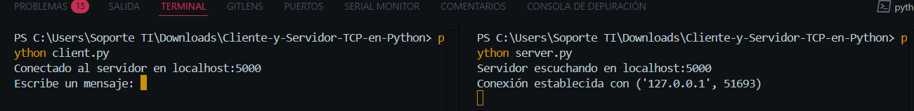
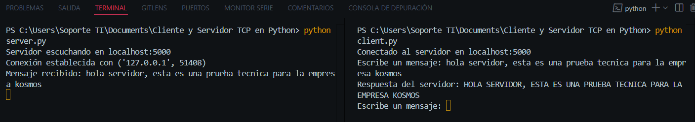
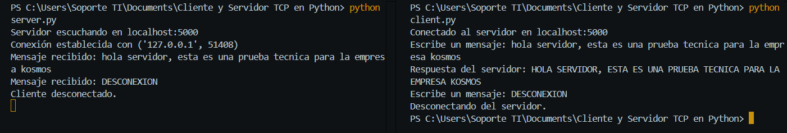

# Instrucciones para Ejecutar el Servidor y el Cliente

## Requisitos Previos
- Python instalado (versión 3.6 o superior).

## Pasos para Ejecutar

### Ejecutar el Servidor
1. Abrir una terminal o consola.
2. Entrar al directorio donde se encuentra `server.py`.
3. Ejecutar el siguiente comando:
    ```bash
    python server.py
    ```
4. El servidor mostrará el mensaje `Servidor escuchando en localhost:5000`.

### Ejecutar el Cliente
1. Abrir una nueva terminal o consola.
2. Navegar al directorio donde se encuentra `client.py`.
3. Ejecutar el siguiente comando:
    ```bash
    python client.py
    ```
4. Ingresar mensajes para enviarlos al servidor.


---

# Pruebas Manuales

## Prueba 1: Verificación de Mensaje en Mayúsculas

**Objetivo:** Confirmar que el servidor responde con el mensaje recibido en mayúsculas.

**Pasos:**
1. Ejecutar `server.py` para iniciar el servidor.
2. Ejecutar `client.py` para iniciar el cliente.
3. Ingresar un mensaje de texto normal (por ejemplo: `hola servidor`).
4. Verificar que el cliente muestre la respuesta del servidor en mayúsculas (por ejemplo: `HOLA SERVIDOR`).



**Resultado Esperado:** El servidor responde con el mismo mensaje en mayúsculas.

---

## Prueba 2: Verificación de Desconexión

**Objetivo:** Confirmar que el cliente y el servidor cierran correctamente la conexión al recibir el mensaje "DESCONEXION".

**Pasos:**
1. Ejecutar `server.py` para iniciar el servidor.
2. Ejecutar `client.py` para iniciar el cliente.
3. Ingresar el mensaje `DESCONEXION`.
4. Verificar que el cliente muestre el mensaje de desconexión y cierre la conexión.
5. Verificar que el servidor muestre un mensaje indicando que el cliente se ha desconectado.


**Resultado Esperado:** La conexión se cierra correctamente en ambos lados.

